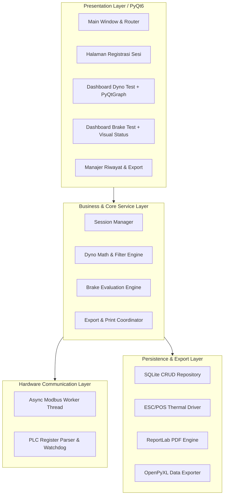
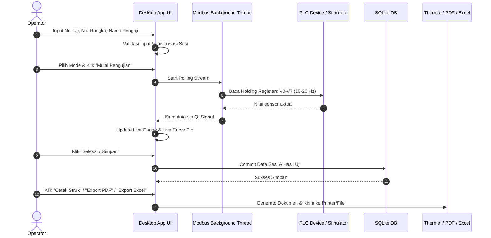
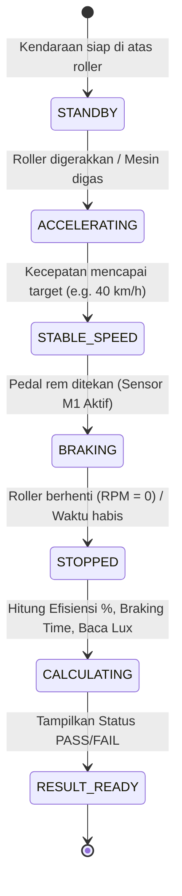

# Arsitektur Sistem & Spesifikasi Teknis: DynoTest & BrakeTest

Dokumen ini mendefinisikan arsitektur teknis, spesifikasi API Modbus PLC (Register Map), diagram alur sistem, skema database, dan rancangan modul perangkat lunak.

---

## 1. Arsitektur Komponen Perangkat Lunak (Layered Architecture)

Aplikasi dibangun menggunakan pola **Layered Modular Architecture** untuk memisahkan logika UI, kalkulasi bisnis, akses database, dan komunikasi perangkat keras:



---

## 2. Spesifikasi API Hardware: Modbus TCP Register Map

Aplikasi berkomunikasi dengan PLC menggunakan standar **Modbus TCP** (Port default `502`, Unit ID `1`).

### A. Holding Registers (Function Code 03 / 06)

| Address (Offset) | Register PLC | Tipe Data | Faktor Skala | Rentang Nilai | Deskripsi & Satuan |
|---|---|---|---|---|---|
| `0` | `V0` | `UINT16` | $\times 1$ | 0 – 15,000 | **RPM Mesin / Dyno Roller** (RPM) |
| `1` | `V1` | `INT16` | $\times 0.1$ | 0 – 2,000.0 | **Torsi Dyno** (Nm, nilai mentah dikali 10) |
| `2` | `V2` | `UINT16` | $\times 1$ | 0 – 5,000 | **RPM Roller Brake Test** (RPM) |
| `3` | `V3` | `UINT16` | $\times 1$ | 0 – 20,000 | **Gaya/Torsi Rem** (Newton / Nm) |
| `4` | `V4` | `UINT16` | $\times 0.01$ | 0 – 60.00 | **Waktu Pengereman (Braking Time)** (Detik, resolusi 10ms) |
| `5` | `V5` | `UINT16` | $\times 1$ | 0 – 65,535 | **Intensitas Cahaya Lampu (Lux)** (Lux) |
| `6` | `V6` | `UINT16` | $\times 1$ | 0 – 3,600 | **Running Time Pengujian** (Detik) |
| `7` | `V7` | `UINT16` | $\times 0.1$ | 0 – 200.0 | **Kecepatan Linier Roller** (km/jam) |
| `10` | `V10` | `UINT16` | $\times 1$ | 0 – 100 | **Kode Status Mesin Uji / Mode Aktif PLC** |

### B. Coils / Discrete Bits (Function Code 01 / 05)

| Address (Offset) | Bit PLC | Tipe Data | Arah | Deskripsi |
|---|---|---|---|---|
| `0` | `M0` | `BOOL` | Read/Write | **Trigger Start Test** (1 = Mulai sampling, 0 = Stop) |
| `1` | `M1` | `BOOL` | Read/Write | **Status Sensor Pedal Rem** (1 = Pedal terinjak, 0 = Lepas) |
| `2` | `M2` | `BOOL` | Write | **Tare / Zero Load Cell Calibration** (1 = Reset nol) |
| `3` | `M3` | `BOOL` | Read | **Emergency Stop / Interlock Status** (1 = Aman, 0 = E-Stop) |

---

## 3. Skema Database Lengkap (SQLite Database Schema)

```sql
-- 1. Tabel Master Kendaraan
CREATE TABLE IF NOT EXISTS vehicles (
    vin TEXT PRIMARY KEY,
    test_number TEXT UNIQUE NOT NULL,
    license_plate TEXT,
    vehicle_category TEXT,
    brand_model TEXT,
    engine_capacity_cc INTEGER,
    vehicle_weight_kg REAL DEFAULT 150.0,
    created_at DATETIME DEFAULT CURRENT_TIMESTAMP
);

-- 2. Tabel Sesi Pengujian
CREATE TABLE IF NOT EXISTS test_sessions (
    id INTEGER PRIMARY KEY AUTOINCREMENT,
    vin TEXT NOT NULL,
    inspector_name TEXT NOT NULL,
    test_mode TEXT NOT NULL, -- 'DYNO', 'BRAKE', 'COMBINED'
    tested_at DATETIME DEFAULT CURRENT_TIMESTAMP,
    notes TEXT,
    FOREIGN KEY(vin) REFERENCES vehicles(vin) ON DELETE CASCADE
);

-- 3. Tabel Hasil Pengujian Dyno
CREATE TABLE IF NOT EXISTS dyno_results (
    id INTEGER PRIMARY KEY AUTOINCREMENT,
    session_id INTEGER NOT NULL UNIQUE,
    max_rpm REAL NOT NULL,
    max_torque_nm REAL NOT NULL,
    max_power_hp REAL NOT NULL,
    max_speed_kmh REAL NOT NULL,
    rpm_at_peak_power REAL,
    rpm_at_peak_torque REAL,
    raw_time_series_json TEXT, -- Format: [{"t": 0.1, "rpm": 3000, "torque": 15.2, "hp": 6.4}, ...]
    FOREIGN KEY(session_id) REFERENCES test_sessions(id) ON DELETE CASCADE
);

-- 4. Tabel Hasil Pengujian Rem & Lampu
CREATE TABLE IF NOT EXISTS brake_results (
    id INTEGER PRIMARY KEY AUTOINCREMENT,
    session_id INTEGER NOT NULL UNIQUE,
    initial_speed_kmh REAL NOT NULL,
    peak_braking_force_n REAL NOT NULL,
    braking_time_s REAL NOT NULL,
    total_running_time_s REAL NOT NULL,
    lux_intensity REAL NOT NULL,
    braking_efficiency_pct REAL NOT NULL,
    lux_pass_status TEXT NOT NULL, -- 'PASS', 'FAIL'
    brake_pass_status TEXT NOT NULL, -- 'PASS', 'FAIL'
    overall_status TEXT NOT NULL, -- 'PASS', 'FAIL'
    raw_time_series_json TEXT, -- Format: [{"t": 0.1, "speed": 40.0, "force": 850.0}, ...]
    FOREIGN KEY(session_id) REFERENCES test_sessions(id) ON DELETE CASCADE
);

-- 5. Tabel Konfigurasi / Pengaturan Sistem
CREATE TABLE IF NOT EXISTS app_settings (
    key TEXT PRIMARY KEY,
    value TEXT NOT NULL,
    description TEXT
);
```

---

## 4. Diagram Alur & State Machine

### A. Alur Sesi Pengujian Pengguna (User Flow)


### B. State Machine Siklus Uji Rem (Brake Test Cycle)


---

## 5. Rencana Modul Kode (Directory Structure)

```text
DynoTest/
├── docs/
│   ├── CONTEXT.md             # Single Source of Truth & Ubiquitous Language
│   ├── PRD.md                 # Product Requirements Document & SRS
│   └── ARCHITECTURE.md        # Arsitektur Teknis, Register Map & ERD
├── app/
│   ├── __init__.py
│   ├── config.py              # Konfigurasi aplikasi (IP PLC, Port, Path, Standar Uji)
│   ├── core/
│   │   ├── __init__.py
│   │   ├── modbus_worker.py   # Background Thread komunikasi Modbus TCP (PyQt6 QThread)
│   │   ├── dyno_calculator.py # Kalkulasi HP, Torsi, Top Speed, & Savgol Filter
│   │   └── brake_evaluator.py # Evaluasi Efisiensi Rem, Braking Time, & Kelayakan Lux
│   ├── database/
│   │   ├── __init__.py
│   │   ├── connection.py      # Inisialisasi koneksi SQLite & migrasi tabel
│   │   ├── models.py          # Definisi entitas data (Data Class / ORM)
│   │   └── repository.py      # Operasi CRUD data kendaraan & sesi pengujian
│   ├── exporters/
│   │   ├── __init__.py
│   │   ├── thermal_printer.py # Modul cetak struk ESC/POS (58mm / 80mm)
│   │   ├── pdf_report.py      # Generator laporan PDF A4 bergrafik (ReportLab)
│   │   └── excel_report.py    # Generator laporan Excel multi-sheet (OpenPyXL)
│   └── ui/
│       ├── __init__.py
│       ├── main_window.py     # Navigasi utama & Header status koneksi
│       ├── session_entry_page.py # Form input No Uji, Rangka, Penguji
│       ├── dyno_test_page.py  # Dashboard pengujian Dyno & live chart
│       ├── brake_test_page.py # Dashboard pengujian Rem & Lux meter
│       ├── history_page.py    # Riwayat pengujian, pencarian & export
│       ├── widgets/
│       │   ├── gauge_widget.py # Custom visual gauge tachometer
│       │   └── live_plot.py    # Visualisasi kurva realtime PyQtGraph
│       └── styles.py          # UI Theme, palet warna, tipografi
├── assets/                    # Logo, icon, dan assets visual
├── tests/
│   ├── test_modbus_parser.py  # Unit test pembacaan & konversi register
│   ├── test_dyno_math.py      # Unit test rumus HP & filter peak
│   ├── test_brake_eval.py     # Unit test efisiensi rem & threshold lux
│   └── test_db_crud.py        # Unit test persistensi SQLite
├── server_plc_device_a.py     # Simulator PLC Modbus TCP (Updated V0-V7, M0-M3)
├── requirements.txt
└── main.py                    # Entry point aplikasi desktop
```
