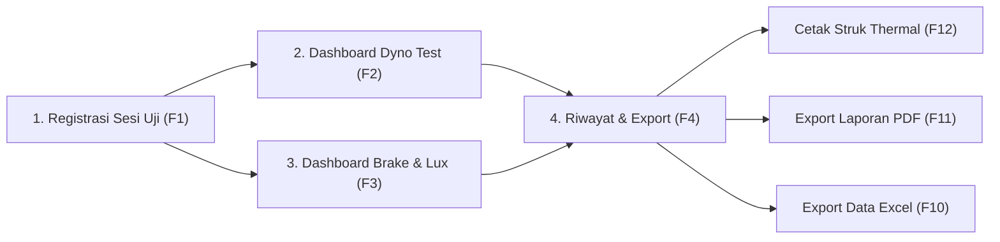

# Design System: DynoTest & BrakeTest

> Last updated: 2026-08-31  
> Theme: Modern Light Industrial Cockpit (White dominant, Anti-Pure-Neutral)

---

## 1. UI/UX Flow & Page Map

### User Flow Diagram

### Page Map
| Halaman | Shortcut | Deskripsi | Komponen Utama |
|---|---|---|---|
| **Registrasi Sesi** | `F1` | Input identitas kendaraan & penguji | Form 2 kolom, tabel riwayat terakhir |
| **Dyno Test** | `F2` | Dashboard uji performa & live chart | Dual Dials, Hero Metric Boxes, PyQtGraph |
| **Brake & Lux Test**| `F3` | Dashboard uji rem & lux meter | Gauge Roller & Gaya Rem, Status Pass/Fail |
| **Riwayat & Laporan**| `F4` | Manajemen hasil & export dokumen | Tabel filter pencarian, tombol export multi-format |
| **Pengaturan Sistem**| `F5` | Konfigurasi PLC & Ambang Batas | Form IP/Port, standard thresholds |

---

## 2. Design Tokens (Light Industrial Palette)

> **CRITICAL RULE:** Dilarang keras menggunakan pure `#FFFFFF` (100% putih) dan pure `#000000` (100% hitam).

| Token | Hex Code | Penggunaan | Kontras |
|---|---|---|---|
| `--bg-app` | `#F1F5F9` | Latar belakang utama jendela aplikasi (*Porcelain Slate*) | Base |
| `--bg-surface` | `#FAFCFE` | Permukaan card panel, input field, sidebar (*Off-White*) | $\ge 4.5:1$ |
| `--bg-metric-box`| `#0F172A` | Kotak angka display hero digital (*Deep Slate Navy*) | $\ge 12:1$ |
| `--border-subtle`| `#CBD5E1` | Garis pembatas panel, grid kurva, border card | $\ge 3:1$ |
| `--text-primary` | `#0E1726` | Teks utama pada surface terang (*Deep Obsidian Ink*) | $\ge 10:1$ |
| `--text-secondary`| `#475569`| Label deskripsi, sub-header, satuan metrik | $\ge 4.5:1$ |
| `--text-hero` | `#F8FAFC` | Angka digital raksasa di dalam `--bg-metric-box` | $\ge 14:1$ |
| `--accent-primary`| `#0284C7`| Arc gauge aktif, tombol aksi primer (*Cobalt Azure*) | $\ge 4.5:1$ |
| `--accent-magenta`| `#E11D48`| Banner status `TEST AKTIF` (*Vivid Crimson*) | $\ge 4.5:1$ |
| `--accent-needle` | `#D97706`| Jarum penunjuk (Needle) dial RPM & Kecepatan | $\ge 4.5:1$ |
| `--accent-success`| `#059669`| Status `LULUS / PASS`, tombol `START` (*Emerald Green*) | $\ge 4.5:1$ |
| `--accent-danger` | `#DC2626`| Status `TIDAK LULUS / FAIL`, tombol `EMERGENCY STOP` | $\ge 4.5:1$ |

---

## 3. Tipografi & Spacing System (8dp Grid)

- **Font UI / Body:** `Segoe UI`, `Inter`, atau `Roboto` (ukuran 13px–14px).
- **Font Display / Hero Metrics:** `Consolas` atau `Roboto Mono` (ukuran 48px–56px, Bold 700).
- **Spacing Grid:** 4px (`--space-1`), 8px (`--space-2`), 16px (`--space-4`), 24px (`--space-5`), 32px (`--space-6`).
- **Touch / Click Target:** Minimal $44 \times 44\text{ px}$ untuk seluruh tombol interaktif.

---

## 4. Spesifikasi Komponen Kustom

1. **`CircularGaugeWidget`**: Dual dial analog modern dengan jarum warna Amber (`#D97706`), busur aktif Cobalt Azure (`#0284C7`), dan digital center cap Deep Slate (`#0F172A`).
2. **`DigitalMetricBox`**: Kotak nilai pembacaan instrumen berlatar `#0F172A` dengan font monospace `#F8FAFC` untuk pembacaan jelas dari kejauhan.
3. **`LiveChartWidget`**: Plot performa realtime PyQtGraph berlatar `#FAFCFE`, kurva HP `#E11D48`, dan kurva Torsi `#0284C7`.
