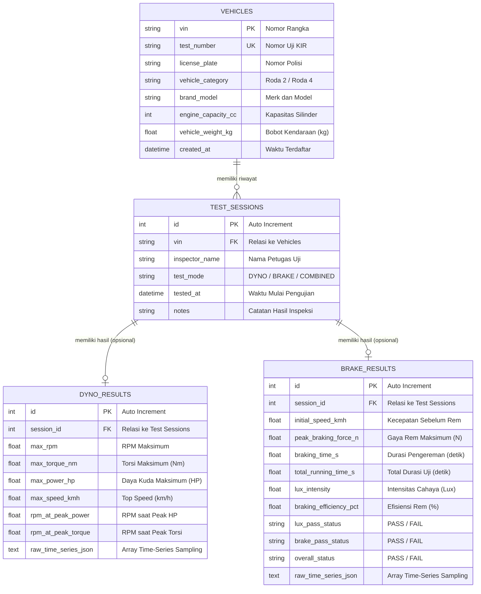

# Database Schema & Data Dictionary (DynoTest & BrakeTest)

> Last updated: 2026-08-31  
> Database Engine: SQLite 3  
> Storage File: `dyno_database.db`  
> Strategy: Embedded Offline-First dengan Transactional Integrity (WAL Mode)

---

## 1. Entity Relationship Diagram (ERD)



---

## 2. Definisi Skema Tabel (SQL DDL)

```sql
-- Aktifkan Foreign Key dan Write-Ahead Logging untuk performa & integritas
PRAGMA foreign_keys = ON;
PRAGMA journal_mode = WAL;

-- 1. Master Kendaraan
CREATE TABLE IF NOT EXISTS vehicles (
    vin TEXT PRIMARY KEY,
    test_number TEXT UNIQUE NOT NULL,
    license_plate TEXT,
    vehicle_category TEXT DEFAULT 'Roda 2',
    brand_model TEXT,
    engine_capacity_cc INTEGER,
    vehicle_weight_kg REAL NOT NULL DEFAULT 150.0,
    created_at DATETIME DEFAULT (DATETIME('now', 'localtime'))
);

CREATE INDEX IF NOT EXISTS idx_vehicles_test_number ON vehicles(test_number);
CREATE INDEX IF NOT EXISTS idx_vehicles_license_plate ON vehicles(license_plate);

-- 2. Sesi Pengujian
CREATE TABLE IF NOT EXISTS test_sessions (
    id INTEGER PRIMARY KEY AUTOINCREMENT,
    vin TEXT NOT NULL,
    inspector_name TEXT NOT NULL,
    test_mode TEXT NOT NULL CHECK(test_mode IN ('DYNO', 'BRAKE', 'COMBINED')),
    tested_at DATETIME DEFAULT (DATETIME('now', 'localtime')),
    notes TEXT,
    FOREIGN KEY(vin) REFERENCES vehicles(vin) ON DELETE RESTRICT ON UPDATE CASCADE
);

CREATE INDEX IF NOT EXISTS idx_sessions_vin ON test_sessions(vin);
CREATE INDEX IF NOT EXISTS idx_sessions_tested_at ON test_sessions(tested_at);

-- 3. Hasil Pengujian Dyno Test
CREATE TABLE IF NOT EXISTS dyno_results (
    id INTEGER PRIMARY KEY AUTOINCREMENT,
    session_id INTEGER NOT NULL UNIQUE,
    max_rpm REAL NOT NULL,
    max_torque_nm REAL NOT NULL,
    max_power_hp REAL NOT NULL,
    max_speed_kmh REAL NOT NULL,
    rpm_at_peak_power REAL,
    rpm_at_peak_torque REAL,
    raw_time_series_json TEXT,
    FOREIGN KEY(session_id) REFERENCES test_sessions(id) ON DELETE CASCADE
);

CREATE INDEX IF NOT EXISTS idx_dyno_session ON dyno_results(session_id);

-- 4. Hasil Pengujian Brake Test & Lux
CREATE TABLE IF NOT EXISTS brake_results (
    id INTEGER PRIMARY KEY AUTOINCREMENT,
    session_id INTEGER NOT NULL UNIQUE,
    initial_speed_kmh REAL NOT NULL,
    peak_braking_force_n REAL NOT NULL,
    braking_time_s REAL NOT NULL,
    total_running_time_s REAL NOT NULL,
    lux_intensity REAL NOT NULL,
    braking_efficiency_pct REAL NOT NULL,
    lux_pass_status TEXT NOT NULL CHECK(lux_pass_status IN ('PASS', 'FAIL')),
    brake_pass_status TEXT NOT NULL CHECK(brake_pass_status IN ('PASS', 'FAIL')),
    overall_status TEXT NOT NULL CHECK(overall_status IN ('PASS', 'FAIL')),
    raw_time_series_json TEXT,
    FOREIGN KEY(session_id) REFERENCES test_sessions(id) ON DELETE CASCADE
);

CREATE INDEX IF NOT EXISTS idx_brake_session ON brake_results(session_id);

-- 5. Pengaturan Aplikasi
CREATE TABLE IF NOT EXISTS app_settings (
    key TEXT PRIMARY KEY,
    value TEXT NOT NULL,
    description TEXT
);
```

---

## 3. Format Payload JSON Time-Series (`raw_time_series_json`)

### Payload Dyno Time-Series
```json
[
  { "t_sec": 0.05, "rpm": 2100.0, "torque_nm": 12.4, "power_hp": 3.65, "speed_kmh": 22.5 },
  { "t_sec": 0.10, "rpm": 2350.0, "torque_nm": 13.8, "power_hp": 4.54, "speed_kmh": 25.1 }
]
```

### Payload Brake Time-Series
```json
[
  { "t_sec": 0.05, "speed_kmh": 41.5, "force_n": 120.0, "brake_pedal": 0 },
  { "t_sec": 0.10, "speed_kmh": 39.8, "force_n": 2450.0, "brake_pedal": 1 }
]
```

---

## 4. Default Seed & Settings Data

```sql
INSERT OR IGNORE INTO app_settings (key, value, description) VALUES
('plc_ip', '127.0.0.1', 'Alamat IP PLC Modbus TCP'),
('plc_port', '502', 'Port Modbus TCP PLC'),
('min_brake_efficiency_pct', '50.0', 'Ambang batas minimum efisiensi rem lulus (%)'),
('max_braking_time_s', '4.0', 'Ambang batas waktu pengereman maksimum (detik)'),
('min_lux_intensity', '12000.0', 'Ambang batas intensitas cahaya lampu utama (Lux)'),
('workshop_name', 'BALAI UJI KENDARAAN & PERFORMA DYNO', 'Nama institusi / bengkel di kop struk dan laporan'),
('workshop_address', 'Jl. Industri Otomotif No. 88, Indonesia', 'Alamat institusi');
```
