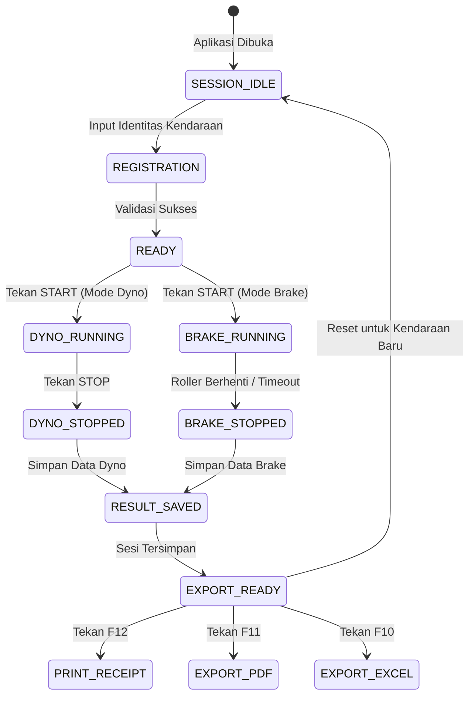

# SRS: Software Requirements Specification (DynoTest & BrakeTest)

> Last updated: 2026-08-31  
> Standard: ISO/IEC/IEEE 29148 / Agile Desktop Specification  
> Target Audience: Software Engineers, QA Engineers, PLC Automation Engineers

---

## 1. Scope & System Overview

Aplikasi Desktop DynoTest & BrakeTest dirancang untuk mengintegrasikan antarmuka grafis modern berbasis **PyQt6** dengan unit kontrol industri **PLC (Programmable Logic Controller)**. Sistem melakukan polling berkala data holding register dan coil Modbus TCP, memproses sinyal melalui filter matematika, menyajikan visualisasi instrumen dial & kurva grafik, serta menyimpan dan mengekspor data pengujian.

### System Actors
| Actor | Type | Deskripsi & Hak Akses |
|---|---|---|
| **Operator / Penguji** | Human | Mengisi data kendaraan, memulai/menghentikan pengujian, mencetak struk dan export laporan. |
| **Administrator / Teknisi** | Human | Mengakses konfigurasi IP PLC, kalibrasi sensor, dan ambang batas kelulusan uji. |
| **Modbus Worker Thread** | System Background | Menjalankan komunikasi socket TCP ke PLC pada 10–50 Hz, memancarkan Qt Signals ke UI. |
| **Database Engine (SQLite)**| System Storage | Menyimpan tabel kendaraan, sesi uji, dan data time-series secara persisten. |

---

## 2. Functional Requirements (FR)

### FR-001: Manajemen Sesi & Registrasi Kendaraan
- **Deskripsi:** Mengambil input identitas kendaraan dan penguji, memvalidasi kelengkapan, dan menginisialisasi sesi pengujian aktif.
- **Priority:** High (Must Have)
- **Actors:** Operator
- **Input Specifications:**
  - `test_number`: String (Format alfanumerik non-empty, min 3 chars).
  - `vin`: String (Format nomor rangka standar, min 5 chars).
  - `inspector_name`: String (Non-empty).
  - `license_plate`: String (Opsional, format plat nomor).
  - `vehicle_weight_kg`: Float (> 0, default 150.0 kg).
  - `test_mode`: Enum (`'DYNO'`, `'BRAKE'`, `'COMBINED'`).
- **Processing Logic:**
  1. Validasi input sanitasi (strip whitespace).
  2. Periksa apakah `vin` sudah ada di tabel `vehicles`. Jika ada, muat data sebelumnya.
  3. Buat record baru di tabel `test_sessions` dengan status `IN_PROGRESS`.
- **Output & Post-conditions:**
  - Sesi aktif diset di `SessionManager`. UI beralih ke halaman pengujian yang dipilih.
- **Error Handling:**
  - Input kosong $\rightarrow$ Tampilkan pesan peringatan visual (QMessageBox / Inline Warning).

---

### FR-002: Modul Akuisisi & Kalkulasi Dyno Test
- **Deskripsi:** Membaca register RPM dan Torsi dari PLC, menghitung Tenaga Kuda (HP) dan Kecepatan, serta memplot kurva realtime.
- **Priority:** High (Must Have)
- **Actors:** Operator, Modbus Worker Thread
- **Processing Logic & Mathematical Formulation:**
  1. Baca register `V0` (RPM) dan `V1` (Torsi mentah $\times 10$ Nm).
  2. Nilai Torsi Aktual: \(\text{Torque (Nm)} = \frac{V1}{10.0}\).
  3. Hitung Daya Kuda (HP):
     \[
     \text{Power (HP)} = \frac{\text{Torque (Nm)} \times \text{RPM}}{7127}
     \]
  4. Hitung Kecepatan Roller (km/jam):
     \[
     v = \frac{2 \pi r_{\text{roller}} \times \text{RPM} \times 60}{1000}
     \]
  5. Perbarui nilai *Peak Power* dan *Peak Torque* jika nilai saat ini melebihi nilai sebelumnya.
- **Output:**
  - Update `CircularGaugeWidget` dan `DigitalMetricBox` setiap frame.
  - Tambahkan titik \((x=\text{RPM}, y=\text{HP})\) dan \((x=\text{RPM}, y=\text{Torque})\) pada `LiveChartWidget`.

---

### FR-003: Modul Pengujian Rem (Brake Test) & Sensor Lux
- **Deskripsi:** Mengukur parameter pengereman kendaraan di atas roller test dan membaca intensitas cahaya lampu utama.
- **Priority:** High (Must Have)
- **Processing Logic:**
  1. Baca register `V2` (RPM Roller), `V3` (Gaya Rem N), `V4` (Waktu Rem ms), `V5` (Lux), dan status bit `M1` (Pedal Rem).
  2. Hitung Efisiensi Pengereman:
     \[
     \text{Braking Efficiency (\%)} = \frac{\text{Gaya Rem Puncak (N)}}{\text{Bobot Kendaraan (kg)} \times 9.81} \times 100\%
     \]
  3. Evaluasi Status Kelulusan (*Pass/Fail*):
     - **Status Rem:** LULUS jika \(\text{Braking Efficiency} \ge 50.0\%\) dan \(\text{Braking Time} \le 4.0\text{ s}\).
     - **Status Lampu (Lux):** LULUS jika \(\text{Lux} \ge 12,000\text{ Lux}\).
     - **Status Keseluruhan:** LULUS jika kedua kriteria terpenuhi.
- **Output:**
  - Tampilkan status LULUS (Badge hijau `#059669`) atau TIDAK LULUS (Badge merah `#DC2626`).

---

### FR-004: Ekspor Laporan & Cetak Struk
- **Deskripsi:** Menghasilkan dokumen keluaran berupa struk thermal printer, dokumen PDF A4, dan spreadsheet Excel.
- **Priority:** High (Must Have)
- **Specifications:**
  - **Thermal Receipt (ESC/POS):** Lebar 58mm / 80mm, mencakup ringkasan identitas dan nilai puncak.
  - **PDF Report (ReportLab):** Format A4 vertikal, kop surat, tabel parameter teknis, kurva dyno chart dan brake chart tersemat.
  - **Excel Report (OpenPyXL):** Sheet 1 (Summary), Sheet 2 (Time-series sample data per 100ms).

---

## 3. Non-Functional Requirements (NFR)

### 3.1 Performance & Latency
- **Polling Loop:** Background thread Modbus berjalan pada 20 Hz (interval 50ms) dengan jitter < 5ms.
- **UI Responsiveness:** Main UI thread tetap responsif pada 60 FPS tanpa jeda input.
- **Memory Footprint:** Konsumsi RAM aplikasi < 150 MB saat pengujian continuous berlangsung.

### 3.2 Reliability & Fault Tolerance
- **Auto-Reconnect:** Jika koneksi socket Modbus TCP terputus, worker mencoba menyambung ulang setiap 2 detik secara transparan tanpa meng-crash UI.
- **Data Safety:** Data sesi yang sedang berjalan di-cache dalam memori dan langsung di-commit ke SQLite saat tombol *Stop/Simpan* ditekan.

### 3.3 Usability & Ergonomics
- **Keyboard Navigation:** Operasi esensial dapat dikontrol sepenuhnya lewat keyboard (`Spasi`, `F1`–`F4`, `F9`–`F12`, `Esc`).
- **Visual Contrast:** Mengikuti *Modern Light Industrial Theme* dengan kontras teks terhadap latar belakang $\ge 7:1$.

---

## 4. State Machine Siklus Pengujian

